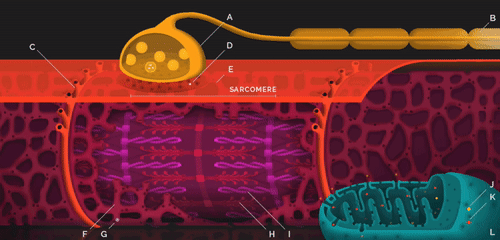
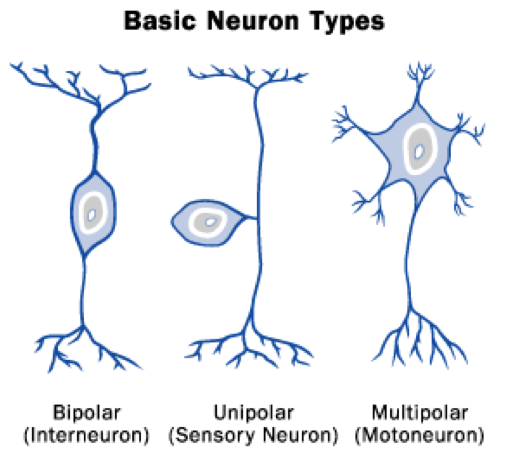
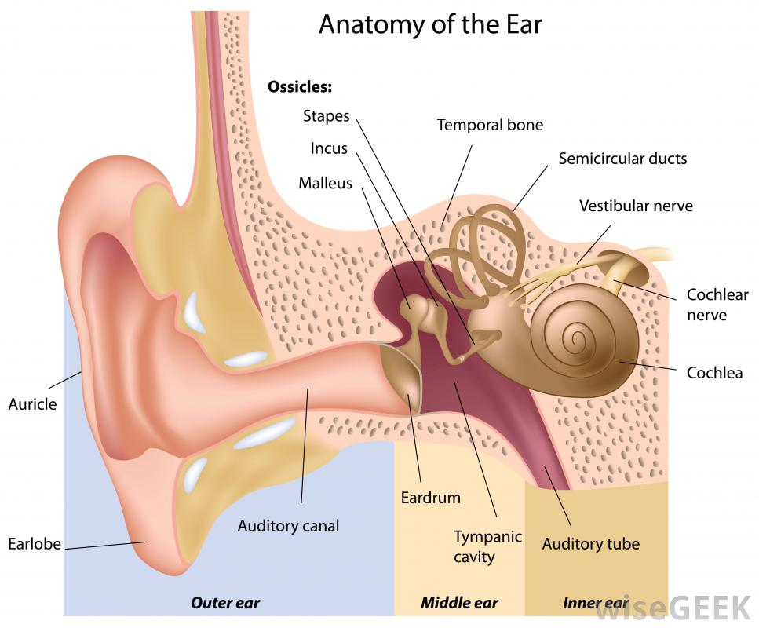

# Anatomy Final Study Guide
---
### Muscle to Know

| Muscle              | Action                                        | Location         |
|---------------------|-----------------------------------------------|------------------|
| biceps brachii      | elbow flexion                                 | upper arm        |
| biceps femoris      | thigh extension, knee flexion                 | femur area       |
| pectoralis major    | flexion, adduction and medial rotation of arm | chest            |
| deltoid             | flexion and medial rotation of arm            | side of shoulder |
| orbicularis oris    | move lips                                     | around mouth     |
| masseter            | elevate mandible, close jaw                   | cheek            |
| zygomaticus         | raises corners of lips                        | cheek area       |
| rectus femoris      | knee extension                                | around knee      |
| tibialis anterior   | movement of dorsiflexion (move tip up)        | front ankle area |
| soleus              | movement of planter flexion (move tip down)   | ankle area       |
| gastrocnemius       | movement of planter flexion (move tip down)   | inner thigh area |
| triceps brachii     | elbow extension, forearm flexion              | upper arm        |
| external oblique    | flexes vertebral column                       | sides of chest   |
| internal oblique    | trunk rotation                                | side of chest    |
| frontalis           | raise eyebrows                                | forehead         |
| sternocleidomastoid | head rotation                                 | side of neck     |
| platysma            | neck flexion                                  |front of neck|

---
### Sliding Filament Theory

（A: neuron synapse, B: myelin sheaths, F: sarcoplasmic reticulum, G: calcium ion, H: myosin, I: Actin, J: ATP, K: ADP)



1. Action Potential causes SR (sarcoplasmic reticulum) to release calcium
2. Calcium binds to troponin, removing tropomyosin from the binding sites on the actin
3. The myosin head binds to actin
4. ATP releases energy pulling it towards the H zone (power stroke)

#### What are the two elements that fluctuate once the ligated channel opens 
- Na, K

#### What prevents actin and myosin from forming together?
- tropomyosin

#### What has binding site for calcium
- troponin

#### Muscle layers
1. Epimysium
2. Perimysium
3. Endomysium
4. Muscle Fiber
5. Myofibril
6. Sarcomere

#### What removes ACH from ligated channel
- cholinesterase
s
#### What structure in the axon terminal that holds neurotransmitters?
- Vesicles

---
## know the following terms

| Term                    | Definition                                                                                                               |
|-------------------------|--------------------------------------------------------------------------------------------------------------------------|
| neuromuscular junction  | the region where a motor neuron comes into close contact with a skeletal muscle cell                                     |
| lactic acid             | the product of anaerobic metabolism, especially in muslce                                                                |
| neurotransmitter        | chemical released by neurons that may, upon binding to receptors of neurons or effector cells, stimulate or inhibit them |
| acetylcholine           | a neurotransmitter that causes muscle contraction                                                                        |
| acetylcholinesterase    | an enzyme that catalyzes the breakdown of ACH                                                                            |
| vesicles                | small enclosed structure or cavity                                                                                       |
| synapse                 | the region of communication between neurons, or a neuromuscular junction between a neuron and a muscle cells             |
| motor end plate         | neuromuscular junction                                                                                                   |
| myosin                  | A band = d**A**rk, thick                                                                                                 |
| actin                   | I band = l**I**ght , thin                                                                                                |
| z disc                  | (z line) thin filaments, measurement of sarcomere                                                                        |
| ATP                     | energy unit                                                                                                              |
| power stroke            | when energy is released for sarcomere to contract                                                                        |

---
### Three Muscle Types

| Type I    | Type IIa   | Type IIx   |
|-----------|------------|------------|
| Slow      | Fast       | Fast       |
| Oxidative | Oxidative  |            |
|           | Glycolytic | Glycolytic |

---
### Describe the amount of ATP yielded by all 3 energy system and what muscle fiber types they recruit within a certain activity

| Creatine Phosphate | Anerobic Glycolysis | Aerobic Phosphorylation |
|--------------------|---------------------|-------------------------|
| Immediate energy   | Short term energy   | Long term energy        |
| 15 sec             | 30 sec              | hours                   |
| 1-2 ATP            | 2 ATP               | 32-38 ATP               |
| Type IIx           | Type IIa            | Type I                  |

---
### List the different types of muscular movement

Flexion: action of bending around a joint of limb
| Movement                | Description                                                                    |
|-------------------------|--------------------------------------------------------------------------------|
| Extension               | straightening movement                                                         |
| Adduction               | movement of a limb toward the midline of the body                              |
| Abduction               | movement of a limb away from the midline of the body                           |
| Circumduction           | moment in a circular motion                                                    |
| Medial/lateral Rotation | movement of limbs along the axis                                               |
| Supination              | in feet and arms, faces forward (can hold soup)                                |
| Pronation               | rotation of the hand and forearm so that the palm faces backwards or downwards |
| Doris flexion           | raising the foot upwards towards the shin                                      |
| Plantar flexion         | movement of the foot in which the foot or toes flex downward                   |
| Inversion               | tilt the sole of foot toward the midline of the body                           |
| Eversion                | tilt the sole of foot away from the midline of the body                        |
| Depression              | downward movement                                                              |
| Elevation               | upward movement                                                                |
| Superior                | toward the head                                                                |
| Inferior                | away from the head                                                             |

---
### Be able to differentiate the `concentric` and `eccentric` motions of the following exercises:

(back squat, bench press, push up, sit up)

`Concentric`: Muscle **Shortens** while applying force

`Eccentric`: Muscle **Lengthens** while applying force

---
### Be able to identify all individual parts of a motor neuron


---
### Identify neurons based on their structural classification



| Unipolar | Bipolar        | Multipolar |
|----------|----------------|------------|
|          | rods and cones |            |


---
### Know the following terms

| Term             | Definition                                                                                                          |
|------------------|---------------------------------------------------------------------------------------------------------------------|
| reflex arc       | a neural pathway that controls a reflex                                                                             |
| spinal cord      | the major column of nerve tissue that is connected to the brain and lies within the vertebral canal                 |
| sensory neurons  | nerve cells within the nervous system responsible for converting external stimuli into internal electrical impulses |
| motor neurons    | a neuron that passes from the central nervous system toward a muscle                                                |
| MS               | cause body to attack the myelin sheath, it causes one to lose control of his/her muscles                            |
| ALS              | cause myelin sheaths to become harder                                                                               |
| myelin           | the fatty substance that covers and protects nerves                                                                 |
| nodes of ranvier | a gap in the myelin sheath of a nerve, between Schwann cells                                                        |
| dendrites        | structures that receives information                                                                                |
| axon terminals   | when reached to the terminal neurotransmitters are released                                                         |
| soma             | bed                                                                                                                 |
| synapse          | the site of transmission of electric nerve impulses between 2 neurons of a neuron and a gland or muscle cell        |
| CNS              | Central Nervous System                                                                                              |
| PNS              | Peripheral Nervous System                                                                                           |

---
### Label the nervous system tree

```
. The nervous system
|
+--- CNS
|    +--- Brain
|    +--- Spinal cord
+--- PNS
|    +--- Afferent
|    +--- Efferent
|    |    +--- Somatic nervous system
|    |    +--- Automatic nervous system
|    |    |    +--- Sympathetic (fight or flight)
|    |    |    +--- Parasymphathetic (rest & digest)
```

---
### Know all of the different types of neuroglia and what nervous system they belong in

- CNS
  - Astrocyte
    - Star-shaped cells that **forms barrier and makes exchanges between capillaries**
  - Microglia
    - Spiderlike cells that **dispose debris**
  - Ependymal
    - **Circulates cerebrospinal fluid**
  - Oligodendrocyte
    - **Forms myelin sheaths**
- PNS
  - Satellite cells
    - Protective cushioning cells
  - Schwann cells
    - **forms myelin sheaths** around nerve fibers in PNS

---
### Know the 3 layers of the eye and what each structure is responsible for

Fibrous tunic (outer layer)
- Sclera
Choroid tunic (middle layer)
- Choroid
- Lens
Sensory Tunic (inner layer)
- retina

---
### Know the following terms

| Term               | Definition                                                                                     |
|--------------------|------------------------------------------------------------------------------------------------|
| rods               | toward the edge of retina, gray tone                                                           |
| cones              | toward the center of retina, color vision                                                      |
| sclera             | the white outer layer of the eyeball                                                           |
| lens               | behind the iris, a structure that bends light                                                  |
| cornea             | front part of the eye that covers the iris and the pupil                                       |
| pupil              | an opening in the center of the pupil                                                          |
| retina             | a layer at the back of the eyeball that contains rod cells and cone cells                      |
| optic chiasm       | an X-shaped structure formed by the crossing of the optic nerve in the brain                   |
| lncus              | a small structure that transmits vibrations between the malleus and stapes                     |
| malleus            | a small structure that transmits vibrations between the eardrum to the incus                   |
| stapes             | a small structure that transmits vibrations between the incus and the opening of the inner ear |
| inner ear          | includes organ for hearing and balance, has the bony labyrinth                                 |
| outer ear          | involved in hearing only, pinna-cartilage of ear                                               |
| middle ear         | air-filled cavity within the temporal bone, only involved in the sense of hearing              |
| auditory tube      | connects the middle ear to throat, equalizes pressure (yawning and swallowing)                 |
| auditory canal     | cannel from outside to inside of ear                                                           |
| tympanic membrane  | the eardrum                                                                                    |
| cochlea            | turn vibrations into neural signals                                                            |
| vestibule          | respond to changes of head with gravity                                                        |
| semicircular canel | help with balance                                                                              |
| olfaction          | chemoreceptors that form the sense of smell                                                    |




#### Sound
Eardrum -> Malleus -> Incus

#### Which bone lies behind the Tympanic membrane?
- Malleus

---
### List the 12 cranial nerves in order and differentiate whether they are sensory or motor

1. Olfactory (s)
2. Optic (s)
3. Oculomotor (m)
4. Trochlear (m)
5. Trigeminal (sm)
6. Abducens (m)
7. Facial (sm)
8. Vestibulocochlear (s)
9. Glossopharyngeal (sm)
10. Vagus (sm)
11. Accessory (m)
12. Hypoglossal (m)

**Memorize**:
- On old Olympus's tower top, Finn and German viewed some hops
- Some say marry money but my brother says big brains matter more

---
### Know the functions for Optic, Vestibulocochlear and Olfactory

| Olfactory | Optic  | Vestibulocochlear |
|-----------|--------|-------------------|
| Smell     | Vision | Sound             |


#### What is the largest portion of the brain?
- Cerebrum

---
### List the 4 lobes of the cerebrum and all the structures of the diencephalon

**4 Lobes of Brain**
- Frontal
- Occipital
- Parietal
- Temporal

**Diencephalon**
- Thalamus (relay center)
- Hypothalamus (autonomic control center)
- Epithalamus (body temp, food, and water control)
- Pipuitary gland (hormone, sleep-wake cycle)

---
### List the pathway of blood through the heart

1. `Veins` -> `Superior & inferior cava`
2. `R. Atrium` -> `Tricuspid U.`
3. `R. Ventricles` -> `P. Valve` -> `P. Artery`
4. `Lungs` -> `P. Veins`
5. `L. Atrium` -> `Bicuspid Valve` -> `L. Ventricle`
6. `Aortic Valve` -> `Aorta`

---
### List all types of WBC's

- Granulocytes
  - Neutrophil
  - Basophil
  - Eosinophil
- Agranulocytes
  - Lymphocyte
  - Monocyte

---
### Functions and structures of the cardiovascular system

Function
- Deliver oxygen and nutrients to the body
- Remove carbon dioxide and other waste product

Structure
- Heart (Pumps the blood through the body)
  - Right atrium
  - Left atrium
  - Right ventricle
  - Left ventricle
  - Superior & Inferior Vena Cava
  - Pulmonary arteries
  - Pulmonary veins
  - Aorta
  - AV Valve
  - Semilunar Valve
- Blood Vessels
  - `Arteries` carry blood with oxygen away from the heart (away)
  - `Veins` carry deoxygenated blood back to the heart
  - `Capillaries` exchange the gases


